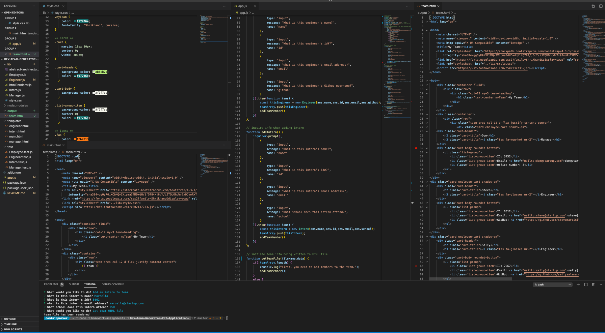

# Dev Team Generator CLI Application

## An application that inputs development team members and outputs a team HTML file.  

  

## Table of Contents

* [Description](#description)
* [Installation](#installation)
* [Usage](#usage)
* [License](#license)
* [Contributing](#contribution)
* [Tests](#tests)
* [Questions](#questions)

## Description 

This is a simple application that asks the user what team members are part of their team, and then takes their response and creates an HTML file with a compiled view of this team. I created it to experiment with node.js, modularization, classes, and constructor methods. To create it, I essentially created classes for the different types of employees that could be entered into the team, then created an inquire process that asks the user for details about the employee members on their team. After, the user's input data is compiled and rendered to an HTML file using a combination of modularized HTML templates for the different types of employees.  

### Code Example 1
  
  
### Code Example 2
  
  
### Example of HTML showing to browser

## Installation

To install this project, you will need to install the npm inquirer package.

## Usage 

To use the application, use node to open the index.js file in your terminal. You'll be prompted with a series of questions and this will guide you to the point of receiving the HTML file. 

## License

This application is covered under a [MIT License](https://opensource.org/licenses/MIT).

## Contributing

Feel free to offer suggestions. I'm sure there are many improvements I can make to it.

## Tests

No tests currently, but feel free to test it out.

## Questions

Got questions? Feel free to contact me.  
Github username: [domjparker](https://github.com/domjparker)  
Email address: dominic.j.parker@gmail.com

---

© 2020, Dominic Parker. All Rights Reserved.

